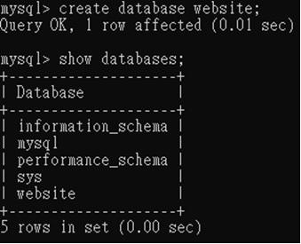

# **Task 2**
   #### *  Create a new database named website
       
       
        
   #### *  Create a new table named member, in the website database, designed as below:
        CREATE TABLE member(id BIGINT PRIMARY KEY AUTO_INCREMENT COMMENT 'Unique ID',name VARCHAR(255) NOT NULL COMMENT 'Name',username VARCHAR(255) NOT NULL COMMENT 'Username',password VARCHAR(255) NOT NULL COMMENT 'Password',follower_count INT UNSIGNED NOT NULL DEFAULT 0 COMMENT 'Follower Count',time DATETIME NOT NULL DEFAULT(CURRENT_TIME) COMMENT 'Signup Time')

